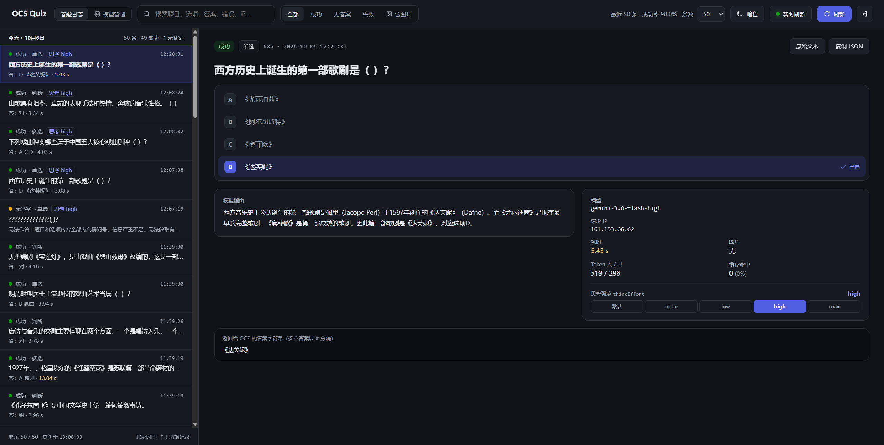
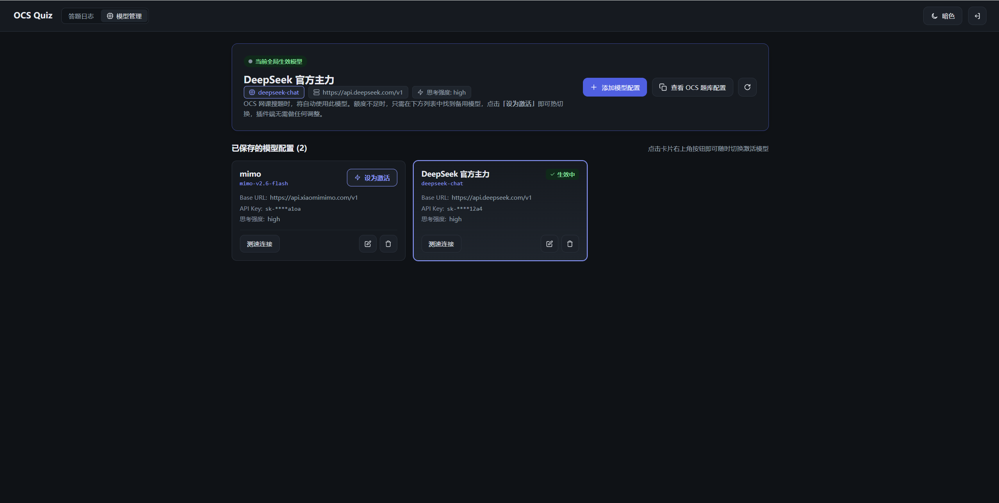
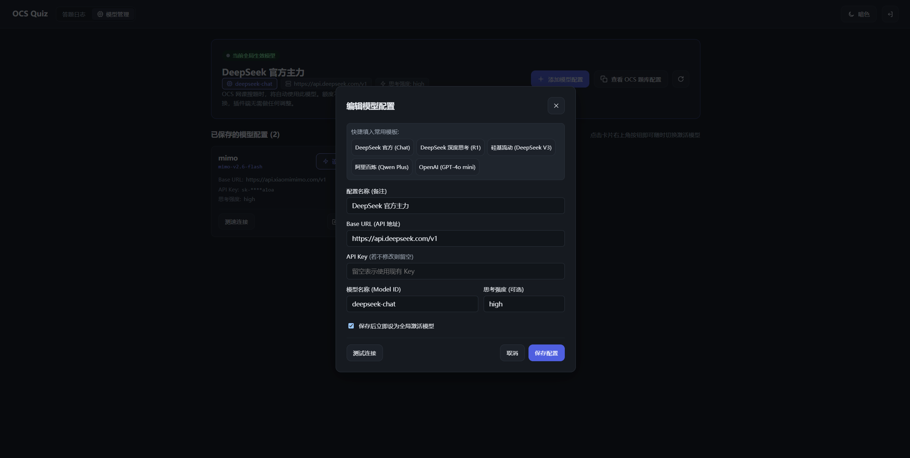

# OCS Quiz 增强版 (OCS AI 智能题库)

<p align="center">
  
</p>

给 [OCS 网课助手](https://docs.ocsjs.com/) 用的 AI 题库，基于 Cloudflare Workers + D1 架构。把 OCS 发来的题目智能分发给大模型深度推理作答，再将标准化答案返回给 OCS 自动填写。

- 🎓 **双平台完美适配**：针对**智慧树**与**超星学习通**全版本 DOM 结构进行智能解析，彻底解决多行排版错位问题。
- ⚡ **独家内置模型管理看板 (Model Hub)**：在网页后台保存多家服务商 Key，**一键测速诊断、一键激活/秒级热切换**，OCS 插件端永久无需重复修改。
- 🧠 **思维链 (CoT) 深度推理**：先推导题干考点与选项对错，再输出答案；硬性约束多选题严禁单选漏选；判断题智能正负极性对齐。准确率由原生版的 40%~70% 大幅提升至 **90%~95%+**。
- 🌐 **广泛兼容**：支持 OpenAI 格式、DeepSeek、Google Gemini、通义千问、硅基流动等主流模型。
- 💰 **终身免费**：利用 Cloudflare 免费套餐（Workers + D1 5GB 数据库），个人日常刷课终身零成本。

---

## 🌟 与上游原项目 (`swim233/ocs-quiz`) 的区别与核心增强

本项目在上游原版基础之上进行了**全方位重构、准确率深度优化与全新功能扩展**：

| 功能 / 特性 | 上游原版项目 (`swim233/ocs-quiz`) | 本增强版项目 (`NandaNg314/ocs-quiz`) |
| :--- | :--- | :--- |
| **模型管理后台 (Model Hub)** | ❌ **无**（仅支持 OCS 端传递 Key 或改环境变量） | ✅ **新增完整管理看板**：支持后台集中安全保存多模型 Key，支持一键连通性测速诊断、一键激活/秒级热切换 |
| **智慧树 / 超星跨行选项解析** | ❌ **严重错位 Bug**（按换行切分行标，导致选 D 错位取成 B，正确率暴跌至 40% 左右） | ✅ **重构结构化选项引擎**：智能识别跨行、独立字母标号与紧凑格式，彻底修复错位缺陷，两大平台 100% 稳定匹配 |
| **多选题漏选与单选退化** | ❌ **容易只选 1 项**（提示词无硬性约束，常把多选当单选做直接被判 0 分） | ✅ **强制多选规则约束**：Prompt 与上下文双层拦截，强制多选题必须选 2 项及以上，杜绝漏选 |
| **大模型推理顺序 (CoT)** | ❌ **先答案后理由**（自回归零样本盲猜，无思维链） | ✅ **先思维链分析再出答案**：强制模型先在 `reason` 中推导各选项对错再输出 `answers`，准确率大幅提升至 90%+ |
| **判断题反向选项陷阱** | ❌ **极易反选**（遇到网课“A.错 B.对”时容易颠倒判错） | ✅ **智能极性对齐**：自动识别题干真实正负极性并与页面选项对齐，无论倒序正序均不错选 |
| **深度思考与推理模型支持** | ❌ **不支持思维链统计**（漏计推理 Token） | ✅ **完整支持 `reasoning_tokens` 捕获统计**，完美适配 DeepSeek-R1、Gemini Thinking 等推理模型 |

---

## 🎯 答题模式说明（为什么推荐自己部署）

本项目支持两种使用模式：

1. **【强烈推荐】服务端集中管理热切换模式**：
   - 在 WebUI 管理后台一次性添加各个服务商的 API Key（保存在你自己名下的 Cloudflare D1 数据库中）；
   - 随时一键点击「设为激活」切换模型，**OCS 浏览器端永久无需改动任何配置**；
   - 界面对 API Key 自动掩码脱敏（`sk-****1234`），防录屏泄露。
2. **传统 BYOK（Bring Your Own Key）模式**：
   - API Key 直接写在 OCS 插件中，搜题时随请求发送。服务端不落地保存 Key。

> [!WARNING]
> 请务必只使用你自己部署的 Worker 实例！切勿将你的 API Key 填入别人部署的公开地址，避免额度被盗刷或 Token 泄露。

---

## 一、部署到 Cloudflare

### 准备工作

- 一个 [Cloudflare](https://dash.cloudflare.com/sign-up) 账号（免费套餐即可）
- [Node.js](https://nodejs.org/) **22 或更高版本**
- 一个托管在 Cloudflare 上的自定义域名（中国大陆访问建议绑定，避免 `workers.dev` 被墙）

### 部署步骤

#### 1. 下载代码并安装依赖

```bash
git clone https://github.com/NandaNg314/ocs-quiz.git
cd ocs-quiz
npm install
npm --prefix web install   # 日志与模型管理看板的前端依赖
```

#### 2. 登录 Cloudflare

```bash
npx wrangler login
```
浏览器会自动弹出授权网页，点击允许即可完成登录。

#### 3. 创建 D1 数据库

```bash
npx wrangler d1 create ocs-quiz-db
```
命令执行完毕后会输出一个 `database_id`。打开 `wrangler.toml`，**将其中 `database_id` 替换为你自己的 ID**：

```toml
[[d1_databases]]
binding = "DB"
database_name = "ocs-quiz-db"
database_id = "换成你自己的 database_id"
```
*(数据库表结构会在第一次调用时由 Worker 自动幂等初始化，无需手动建表)*

#### 4. 部署 Worker

```bash
npm run deploy
```
部署完成后终端会输出你的 Worker 地址，例如 `https://ocs-quiz.<子域>.workers.dev`。

#### 5. 设置访问 Token

为了安全隔离，项目设计了两个完全独立的 Token：

| Token 变量名 | 用途 | 怎么填 |
| :--- | :--- | :--- |
| `AUTH_TOKEN` | 搜题接口鉴权 | 填在 OCS 插件题库的 `Authorization` 中，防止他人盗用你的搜题服务 |
| `WEBUI_TOKEN` | 网页管理后台登录凭证 | 浏览器打开后台时输入的管理员密码 |

在终端执行以下命令设置这两个密钥（建议输入足够长的随机字符串）：

```bash
npx wrangler secret put AUTH_TOKEN
npx wrangler secret put WEBUI_TOKEN
```

#### 6. 绑定自定义域名（中国大陆必看）

在中国大陆网络环境下，`*.workers.dev` 原生域名通常无法直接稳定访问。推荐绑定你在 Cloudflare 上的自定义域名：

- **方法 1（配置文件）**：在 `wrangler.toml` 顶部加上以下路由配置后重新执行 `npm run deploy`：
  ```toml
  routes = [
    { pattern = "quiz.yourdomain.com", custom_domain = true }
  ]
  ```
- **方法 2（控制台）**：Cloudflare 控制台 $\rightarrow$ Workers 和 Pages $\rightarrow$ `ocs-quiz` $\rightarrow$ 设置 $\rightarrow$ 域和路由 $\rightarrow$ 添加自定义域。

---

## 二、在 OCS 中配置题库

部署成功后，推荐使用最优雅的**服务端集中管理模式**：

### 推荐配置流程（OCS 端一次配置，终身免改）

1. **打开你的专属配置地址**：
   在浏览器中访问：`https://<你的域名>/ocs-config.json?token=<你的 AUTH_TOKEN>`
2. **复制返回的配置 JSON**：
   页面会返回一段格式化好的 JSON，例如：
   ```json
   [
     {
       "name": "OCS Quiz (AI智能题库)",
       "homepage": "https://quiz.yourdomain.com",
       "url": "https://quiz.yourdomain.com/api/search",
       "method": "post",
       "contentType": "json",
       "type": "GM_xmlhttpRequest",
       "headers": {
         "Content-Type": "application/json",
         "Authorization": "Bearer <你的 AUTH_TOKEN>"
       },
       "data": {
         "title": "${title}",
         "options": "${options}",
         "type": "${type}",
         "apiKey": "",
         "baseUrl": "",
         "model": "",
         "thinkEffort": ""
       },
       "handler": "return (res)=> res.code === 0 ? [res.data.question, res.data.answers.join('#')] : [res.msg, undefined]"
     }
   ]
   ```
   > 💡 **核心优势**：注意上面的 `data.apiKey`、`data.baseUrl`、`data.model` **全都留空即可**！Worker 接收到搜题请求后，会自动使用你在后台激活的大模型。
3. **粘贴到 OCS**：
   在网课页面打开 OCS 悬浮面板 $\rightarrow$ **通用** $\rightarrow$ **全局设置** $\rightarrow$ **题库配置**，将上述 JSON 粘贴进去并保存。

---

## 三、管理后台与模型热切换使用方法

打开浏览器访问你的域名 `https://<你的域名>/`，输入你设置的 `WEBUI_TOKEN` 即可登录管理后台。

### 1. 模型中心 (Model Hub) —— 一键热切换与健康诊断
集中管理所有大模型 API Key，OCS 网课端终身免改配置：
- **集中管理**：保存多家服务商 Key，后台对敏感 Key 自动脱敏加密展示（`sk-****12a4`）。
- **一键测速**：点击卡片上的「测速连接」，Cloudflare 节点直接发起连通性握手，毫秒级反馈延迟。
- **秒级热切换**：点击任意模型卡片右上角 **【⚡ 设为激活】**，下一次网课搜题就会立即自动切换为该模型，**OCS 插件端无需做任何修改**！

<p align="center">
  
</p>

### 2. 快捷配置模版 —— 常用模型一键填入
支持内置快捷模版，快速录入主流大模型（DeepSeek、硅基流动、阿里百炼通义千问、OpenAI 等）：

<p align="center">
  
</p>

### 3. 实时答题日志与思维链 (CoT) 推理分析
实时展示刷题流水线，精准监控做题质量与成功率：
- **实时统计**：展示实时成功率（实测高达 **98%+**）、答题状态与详细耗时。
- **思维链推导**：完整展示大模型在 `reason` 中的推导逻辑与各选项对错分析，做题过程透明可溯。
- **Token 精准计量**：展示输入/输出 Token 及思维链 Token（`reasoning_tokens`）消耗。

<p align="center">
  
</p>

---

## 四、主流模型选型与深度思考配置建议

### 1. 深度思考强度（`thinkEffort`）怎么填？
**结论：在后台或 OCS 中直接【留空】即可！**

- **DeepSeek 官方**：通过模型名称区分模式：
  - 常规极速答题（推荐主力）：模型名填 **`deepseek-chat`**（V3），耗时仅 2~3 秒。
  - 复杂难题深度思考：模型名填 **`deepseek-reasoner`**（R1 满血长思维链），耗时 10~20 秒。
  - 无论哪种，`thinkEffort` 均留空即可。
- **Google Gemini**：
  - 如果使用自带思考的反代或原生 Gemini，通常通过模型名选择档位（如 `gemini-3.8-flash-high`），`thinkEffort` 留空即可自动开启长思维链。
- **OpenAI 官方**（o1 / o3-mini）：
  - 只有对接支持 OpenAI 原生参数时，才需要填写 `low` / `medium` / `high`。

---

## 五、网课答题最佳参数设置（快 + 不超时 + 95%高准确率 + 防封控）

在 OCS 悬浮窗的答题设置中，推荐按照以下黄金参数进行配置：

| 设置项 | 推荐配置值 | 原理与重要说明 |
| :--- | :--- | :--- |
| **搜题最长耗时 (Timeout)** | **`30 ~ 50 秒`** | • 配合思维链模型（如 Gemini / DeepSeek-Chat），实际作答只需 **3 ~ 6 秒**。<br>• 设 30~50 秒可杜绝网络偶尔卡顿死等，同时保证充足的思考时间。 |
| **隔多久搜一道题 (答题间隔)** | **`3 ~ 5 秒`**<br>*(或随机 `3-6` 秒)* | • **防风控核心**：超星与智慧树后台监控单题答题时间，如果 0 秒秒刷会被系统判定脚本作弊。<br>• 模型推理 3~5 秒 + 答题间隔 3~5 秒 = **单题约 7~10 秒**，完全拟合人类读题做题节奏，绝对安全。 |

---

## 六、解决 OCS 跨域问题（题库连接失败排查）

OCS 插件默认使用脚本管理器跨域请求，若未放行你的域名，OCS 会报错提示「题库连接失败」。

三种解决方法任选一种（推荐方法 A）：

### 方法 A：在脚本管理器中添加域名白名单（推荐）
1. 点击浏览器扩展栏的油猴图标（Tampermonkey）$\rightarrow$ 管理面板；
2. 点击「OCS 网课助手」右侧的编辑按钮；
3. 切换至顶部的「设置」标签页，在「XHR 安全」下的「用户域名白名单」中，添加你的自定义域名（如 `quiz.yourdomain.com`）；
4. 保存即可。此方法在脚本自动更新后依然持久生效。

### 方法 B：在脚本头部添加 `@connect`
进入 OCS 脚本编辑界面，在 `// ==UserScript==` 块内加入一行：
```javascript
// @connect quiz.yourdomain.com
```
按 `Ctrl + S` 保存即可。

### 方法 C：安装全域名通用版 OCS
安装官方全域名版，初次使用弹窗询问网络连接时选择「总是允许」：
- [GreasyFork 通用版](https://greasyfork.org/zh-CN/scripts/481438)

---

## 七、常见问题 FAQ

### 1. 长期使用会不会把 Cloudflare Worker 或 D1 空间占满？
**完全不会，请放心长期使用！**
- **代码空间**：整个 Worker + React 前端压缩后仅 **`37.5 KB`**，仅占 Cloudflare 免费配额（10MB）的 **0.3%**。
- **数据库空间**：Cloudflare D1 免费套餐提供 **5 GB** 存储空间（相当于可存储 **250 万道** 题目日志），每天允许写入 10 万次。大学四年高强度刷课几千道题仅消耗十多 MB，连 1% 免费配额都摸不到。

### 2. 学习通和智慧树的题库准确率有差别吗？
此前上游原版存在跨行解析缺陷，在智慧树平台极易误判；**本项目已重构结构化选项引擎，学习通与智慧树两大平台均已完全抹平差异**，无论遇到哪种 DOM 结构均能保持 90%+ 的极高准确率。

### 3. 如何在本地进行开发与调试？
```bash
# 1. 启动本地 Worker 调试（端口 8790）
npm run dev

# 2. 构建前端面板
npm run build:web

# 3. 本地使用专属私有配置一键部署
npm run deploy:local
```

---

## 许可证

[MIT](LICENSE)

## 免责声明

本项目仅供计算机技术研究、API 性能测试与学习交流使用。使用者需严格遵守相关高校、课程平台及大模型服务商之使用规定，因不当使用所产生的一切后果由使用者自行承担。
